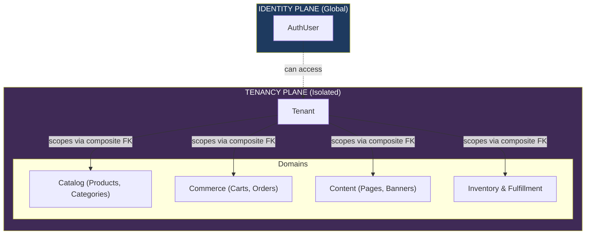

# Module 2 — Multi-Tenant Store Management

**Platform:** All-In-One V2 — Multi-Tenant Headless Commerce Platform
**Module Scope:** `Tenant`, `TenantStatus`
**Audience:** Full-stack engineers, solution architects, QA, technical product managers
**Document Class:** SRS / TDD / Developer Documentation / Admin Manual / Database Documentation

---

## Module Architectural Position

Tenancy is the **commerce plane's isolation boundary**. Everything in the catalog, cart, checkout, CMS, and analytics domains is scoped to a specific `Tenant` (a storefront vertical like "fashion" or "beauty").

Unlike the Identity Plane (which is global), the Tenancy Plane enforces absolute segregation of commercial data through **composite foreign keys**.

**Consequence for developers:** Every read or write inside the commerce plane **must** include a `tenantId`. Because the schema uses composite keys (`@@unique([tenantId, id])`, `@@unique([tenantId, slug])`), attempting to query a product or order by just its `id` will fail Prisma's type checking. The isolation is guaranteed by the schema structure itself.

---

---

# Tenant

## Overview

`Tenant` is the hub of the commerce platform. It defines a storefront vertical, its branding, its custom domain, and acts as the anchor for roughly 35 distinct relations across the database. When a shopper visits `fashion.example.com`, the subdomain maps directly to the `slug` of a `Tenant` record, and that record dictates everything they see.

## Business Purpose

The model exists to allow a single physical platform deployment to host multiple independent e-commerce businesses (or distinct verticals of a single business) without data spillage.

1. **Brand Identity:** Holds the name, slug (subdomain), custom domain, and theme settings.
2. **Lifecycle Control:** Allows the platform owner to suspend or deactivate a storefront independently.
3. **Data Segregation:** Anchors the composite-key isolation strategy for all commercial data.

## Responsibilities

| #   | Responsibility                      | Enforced By                                                                                    |
| --- | ----------------------------------- | ---------------------------------------------------------------------------------------------- |
| 1   | Uniquely identify a vertical        | `id String @id`, `slug String @unique`                                                         |
| 2   | Support custom branding / DNS       | `domain String? @unique`                                                                       |
| 3   | Maintain public visibility state    | `status TenantStatus @default(ACTIVE)`                                                         |
| 4   | Store arbitrary design/theme config | `settings Json?`                                                                               |
| 5   | Anchor all catalog entities         | `categories`, `products`, `variants`, `collections`, `attributes`                              |
| 6   | Anchor all commerce entities        | `carts`, `orders`, `pricingRules`, `promotions`, `coupons`, `taxClasses`, `taxRates`           |
| 7   | Anchor all CMS & marketing          | `pages`, `banners`, `announcements`, `faqs`, `storefrontPages`, `storefrontSections`           |
| 8   | Anchor all inventory data           | `inventoryLocations`, `inventoryStocks`, `inventoryTransactions`                               |
| 9   | Anchor analytics & reporting        | `productSalesStats`, `categorySalesStats`, `customerStats`, `dailySalesStats`, `supplierStats` |

## Features

- **Subdomain Routing:** The `slug` uniquely identifies the tenant and acts as the subdomain.
- **Custom Domains:** Support for mapping a `domain` (e.g., `www.myfashionstore.com`).
- **Reserved Slug Protection:** Prevents collision with infrastructure subdomains (`api`, `admin`, `www`, `cdn`, etc.).
- **Dynamic Configuration:** Unstructured JSON `settings` for theme and contact details.

## Admin Features

- **List All Tenants:** `GET /tenant/all` (guarded by `ADMIN_ROLES` and `SELLER`).
- **Create Tenant:** `POST /tenant`.
- **Update Tenant:** `PATCH /tenant/:id`.

## Customer Features

- **View Active Tenant:** `GET /tenant/:slug` (public resolution). Shoppers only see `ACTIVE` tenants.

## Developer Notes

### Composite-FK Tenant Isolation

This model is the basis of the platform's multi-tenant security model. Earlier iterations of the schema relied on simple foreign keys and application-level `where: { tenantId }` clauses. The schema now uses composite unique constraints.

For example, a `CatalogCategory` is identified by `@@unique([tenantId, id])` and `@@unique([tenantId, slug])`. This guarantees that code cannot mistakenly update a category in one tenant by guessing the `id` from another, because Prisma enforces providing the `tenantId` to satisfy the composite unique constraint during updates.

### Route Behaviors & Slug Reservation

`TenantService` enforces a `RESERVED_SLUGS` list (e.g., `www`, `api`, `admin`, `cdn`). This ensures that a tenant cannot squat on a subdomain needed by the platform infrastructure.

### Known implementation gaps in this module

| Gap                               | Location                               | Impact                                                                                                                                                                                                                                                                                                |
| --------------------------------- | -------------------------------------- | ----------------------------------------------------------------------------------------------------------------------------------------------------------------------------------------------------------------------------------------------------------------------------------------------------- |
| Insecure Authorization on Updates | `tenant.route.ts`, `tenant.service.ts` | The `PATCH /tenant/:id` route is guarded by `authorize(...ADMIN_ROLES, UserRole.SELLER)`. However, `TenantService.updateTenant` receives no user context and performs no ownership checks. **A user with the `SELLER` role can rename, suspend, or hijack the domain of ANY tenant on the platform.** |
| Missing Deletion Flow             | `tenant.route.ts`                      | `TenantStatus.DELETED` exists in the enum, but there is no `DELETE` route. A tenant can be suspended but never deleted via the API.                                                                                                                                                                   |
| Lack of Seller Ownership Model    | `schema.prisma`                        | As noted in Module 1, there is no mapping between `AuthUser` (Seller) and `Tenant`. A tenant is an orphan entity with no owner.                                                                                                                                                                       |

The authorization gap on `PATCH /tenant/:id` is a critical severity issue. A seller can modify a competitor's tenant configuration.

## Fields Explanation

| Field       | Type            | Purpose                                | Required | Notes                                                                                  |
| ----------- | --------------- | -------------------------------------- | -------- | -------------------------------------------------------------------------------------- |
| `id`        | `String` (UUID) | Primary key                            | Yes      |                                                                                        |
| `slug`      | `String`        | Subdomain identifier (e.g., `fashion`) | Yes      | `@unique`. Cannot match `RESERVED_SLUGS`.                                              |
| `name`      | `String`        | Human-readable storefront name         | Yes      |                                                                                        |
| `domain`    | `String?`       | Optional custom DNS domain             | No       | `@unique`. Validated for conflicts on create/update.                                   |
| `status`    | `TenantStatus`  | Lifecycle state                        | Yes      | Defaults to `ACTIVE`. `SUSPENDED` and `DELETED` tenants are hidden from public routes. |
| `settings`  | `Json?`         | Theme and configuration payload        | No       | Free-form JSON block.                                                                  |
| `createdAt` | `DateTime`      | Creation timestamp                     | Yes      |                                                                                        |
| `updatedAt` | `DateTime`      | Last mutation timestamp                | Yes      |                                                                                        |
