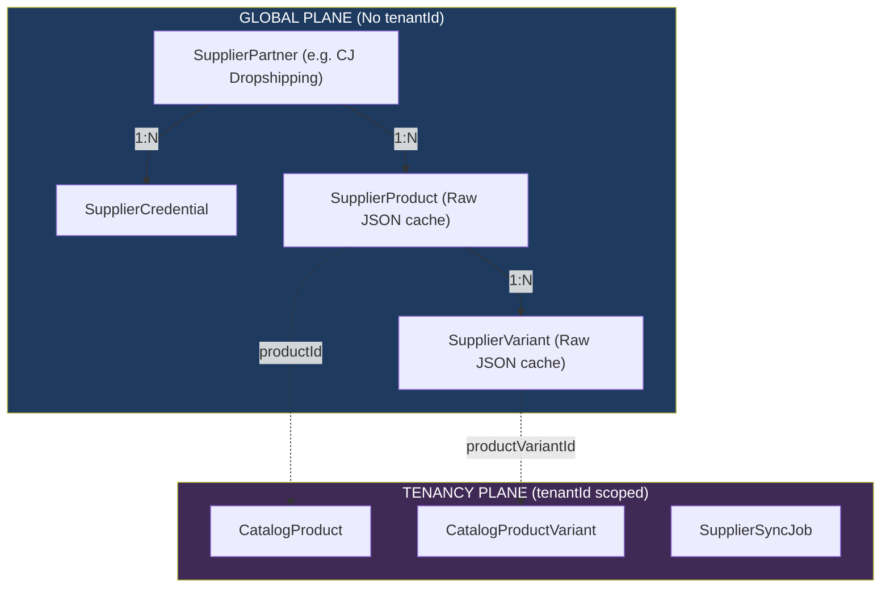

# Module 4 — Multi-Supplier Dropshipping Schema

**Platform:** All-In-One V2 — Multi-Tenant Headless Commerce Platform
**Module Scope:** `SupplierPartner`, `SupplierCredential`, `SupplierSyncLog`, `SupplierSyncJob`, `SupplierProduct`, `SupplierVariant`, `SupplierProductImage`, `SupplierVariantImage`
**Audience:** Backend engineers, data engineers, integration architects
**Document Class:** SRS / Developer Documentation / Integration Guide

---

## Module Architectural Position

The Dropshipping module acts as a **bridge between the global platform and individual tenant catalogs**.

This module fundamentally deals with data that belongs to a third party (like CJ Dropshipping, AliExpress, or Printful) that a tenant wishes to sell. The architectural design decision here is to **cache and standardize** supplier data in a set of `Supplier*` tables before it maps into the `Catalog*` tables of a specific tenant.

## Business Purpose

The system must integrate with numerous external API suppliers. Rather than building custom database models for each supplier's unique product structure, this module adopts a **raw cache + generic mapping** strategy.

1. **API Abstraction:** Normalizes basic concepts like "Cost Price" while storing the supplier's true raw payload in a `Json` column.
2. **Offline Browsing:** Allows the platform to search, browse, and map supplier products without making live, rate-limited HTTP calls.
3. **Price/Stock Syncing:** Provides the structural foundation for background jobs (`SupplierSyncJob`) to update prices and stock counts periodically.

## Responsibilities

| #   | Responsibility                                 | Enforced By                                    |
| --- | ---------------------------------------------- | ---------------------------------------------- |
| 1   | Register available supplier integrations       | `SupplierPartner`                              |
| 2   | Store API keys per environment                 | `SupplierCredential`                           |
| 3   | Cache supplier catalog items locally           | `SupplierProduct`, `SupplierVariant`           |
| 4   | Preserve true raw API responses                | `rawData Json` on both Product/Variant         |
| 5   | Link cached supplier items to storefront items | `productId` and `productVariantId` FKs         |
| 6   | Schedule async sync tasks                      | `SupplierSyncJob`                              |
| 7   | Log sync history and errors                    | `SupplierSyncLog`                              |
| 8   | House supplier product imagery                 | `SupplierProductImage`, `SupplierVariantImage` |

---

## Feature Drill-Down

### 1. The Supplier Product Cache (`SupplierProduct` & `SupplierVariant`)

These tables store the third-party products. They exist **outside** of the `tenantId` scope. The idea is that the platform pulls 10,000 products from CJ Dropshipping once, stores them in `SupplierProduct`, and then tenants can map them into their individual `CatalogProduct` tables.

- **`rawData Json`**: This is the source of truth. Since every supplier has different attributes, all arbitrary fields go here.
- **Denormalized Fields**: A few critical fields (`title`, `costPrice`, `thumbnailUrl`) are extracted into explicit columns. This allows the API to list products efficiently without scanning JSON trees.

### 2. Supplier Connections (`SupplierPartner` & `SupplierCredential`)

A `SupplierPartner` represents an integration (e.g. `name: "cj-dropshipping"`). A `SupplierCredential` holds the actual API keys. Note that credentials are not tenant-scoped; this means a single global API key is used to speak to the supplier on behalf of all tenants on the platform.

### 3. Sync & Import Operations (`SupplierSyncJob` & `SupplierSyncLog`)

`SupplierSyncJob` (which _is_ tenant-scoped) acts as the queue for background workers to pull price/stock updates. The results of these syncing processes are recorded in `SupplierSyncLog`.

---

## Developer Notes

### Known Implementation Gaps (Critical)

Grounding this schema against `product-import.service.ts` reveals several massive architectural and security flaws:

| Gap                                         | Location                                        | Impact                                                                                                                                                                                                                                                                                                                                                                                                                                                                                                                                    |
| ------------------------------------------- | ----------------------------------------------- | ----------------------------------------------------------------------------------------------------------------------------------------------------------------------------------------------------------------------------------------------------------------------------------------------------------------------------------------------------------------------------------------------------------------------------------------------------------------------------------------------------------------------------------------- |
| **Global SupplierProduct Hijacking**        | `schema.prisma`, `product-import.service.ts:85` | `SupplierProduct` is global (no `tenantId`) but points to exactly **one** `CatalogProduct` (`productId String?`). If Tenant A imports "Widget", `SupplierProduct.productId` points to Tenant A. If Tenant B imports the exact same "Widget", the code performs an `upsert` on the unique `[supplierId, externalId]` key, changing the pointer to Tenant B. **Tenant A's product is silently orphaned and will never receive sync updates again.** The platform currently cannot support two tenants selling the same dropshipped product. |
| **Silent Overwrites via Slug Collision**    | `product-import.service.ts:56-62`               | The import service generates a `slug` by normalizing and truncating the title to 200 characters, then uses this slug in a `tenantId_slug` `upsert`. If a supplier provides two products with very similar long titles, the second import will silently overwrite the first `CatalogProduct`.                                                                                                                                                                                                                                              |
| **Instant Publishing (Unreviewed Content)** | `product-import.service.ts:72`                  | The `upsert` block hardcodes `status: ProductStatus.PUBLISHED`. Whatever Title, Description, and tags the supplier provides are instantly live on the storefront. A supplier renaming their product to something malicious or inappropriate will go live to shoppers immediately.                                                                                                                                                                                                                                                         |
| **Global API Credentials**                  | `schema.prisma`                                 | Credentials belong to the platform, not the tenant. There is currently no way for a tenant to supply their own API keys for an integration.                                                                                                                                                                                                                                                                                                                                                                                               |

## Fields Explanation (Key Models)

### `SupplierProduct`

| Field        | Type      | Purpose                         | Required | Notes                                                     |
| ------------ | --------- | ------------------------------- | -------- | --------------------------------------------------------- |
| `externalId` | `String`  | Supplier's own primary key      | Yes      | `@unique` alongside `supplierId`.                         |
| `productId`  | `String?` | The `CatalogProduct` it maps to | No       | **CRITICAL FLAW:** Allows only one mapping platform-wide. |
| `rawData`    | `Json`    | Full supplier JSON payload      | Yes      | The true source of truth.                                 |
| `costPrice`  | `Decimal` | Wholesale cost                  | Yes      | Used to calculate margins against selling price.          |

### `SupplierSyncJob`

| Field      | Type         | Purpose                        | Required | Notes                                                    |
| ---------- | ------------ | ------------------------------ | -------- | -------------------------------------------------------- |
| `tenantId` | `String`     | Tenant requesting the sync     | Yes      | Background workers must impersonate this tenant context. |
| `action`   | `String`     | "SYNC_PRODUCTS", "SYNC_ORDERS" | Yes      | The type of sync requested.                              |
| `status`   | `SyncStatus` | PENDING, IN_PROGRESS, etc      | Yes      | Worker orchestration state.                              |
| `payload`  | `Json?`      | Arguments for the job          | No       |                                                          |
