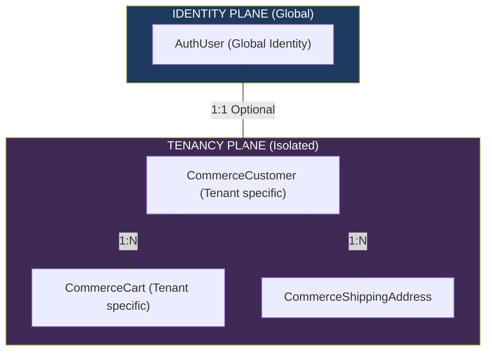

# Module 5 — Commerce: Customers, Carts & Shipping

**Platform:** All-In-One V2 — Multi-Tenant Headless Commerce Platform
**Module Scope:** `CommerceCustomer`, `CommerceShippingAddress`, `CommerceCart`, `CommerceCartItem`
**Audience:** Full-stack engineers, solution architects
**Document Class:** SRS / Developer Documentation

---

## Module Architectural Position

This module represents the beginning of the **Tenancy Plane**. It bridges the gap between the global identity (`AuthUser`) and a specific storefront's commerce data.



When a user logs in and browses the "Fashion" tenant, they are still a global `AuthUser`. But as soon as they add something to a cart or save a shipping address, a `CommerceCustomer` record is created to track their commercial activity on that specific tenant.

**Critical Observation:** Looking closely at the `CommerceCustomer` schema, there is **no `tenantId`** on the model!

```prisma
model CommerceCustomer {
  id        String   @id @default(uuid())
  userId    String   @unique
  email     String   @unique
  // ...
}
```

This contradicts the "Tenancy Plane" architectural theory outlined in Module 1. If `CommerceCustomer` lacks a `tenantId`, it means a customer's commercial profile (and their shipping addresses) is actually **shared across all storefronts**. However, their carts (`CommerceCart`) and orders (`CommerceOrder`) DO have `tenantId` fields.

---

## Business Purpose

1. **Customer Profiling:** Segregate authentication (passwords, social logins) from commerce operations (shipping addresses, lifetime value).
2. **Shopping Carts:** Track ephemeral and persistent pre-checkout states scoped by tenant.
3. **Address Book:** Provide a reusable address book for rapid checkouts.

## Responsibilities

| #   | Responsibility                               | Enforced By                                         |
| --- | -------------------------------------------- | --------------------------------------------------- |
| 1   | Link a global identity to commerce functions | `CommerceCustomer.userId @unique`                   |
| 2   | Maintain a reusable address book             | `CommerceShippingAddress`                           |
| 3   | Manage tenant-scoped pre-checkout state      | `CommerceCart.tenantId`                             |
| 4   | Support guest checkouts                      | `CommerceCart.sessionId` / `customerId` is optional |

## Developer Notes

### Known Implementation Gaps (Critical)

| Gap                                     | Location                  | Impact                                                                                                                                                                                                                                                       |
| --------------------------------------- | ------------------------- | ------------------------------------------------------------------------------------------------------------------------------------------------------------------------------------------------------------------------------------------------------------ |
| **Missing Tenancy on Customer Profile** | `CommerceCustomer` schema | The model has no `tenantId`. A shipping address saved on the "Beauty" storefront will appear when checking out on the "Fashion" storefront. If the verticals are meant to be completely independent brands, sharing the address book breaks brand isolation. |
| **No Guest Customer Support**           | `CommerceCustomer` schema | `userId` is marked `@unique` and required. This means a customer MUST create an account to have a `CommerceCustomer` profile. Guest checkouts are structurally forced to either skip creating a customer profile or be denied outright.                      |
| **Cart Isolation**                      | `CommerceCart` schema     | Uses `@@unique([tenantId, customerId])` and `@@unique([tenantId, sessionId])`. This correctly ensures a user can only have one active cart per storefront.                                                                                                   |

---

## Fields Explanation (Key Models)

### `CommerceCustomer`

| Field    | Type     | Purpose              | Required | Notes                                                                                |
| -------- | -------- | -------------------- | -------- | ------------------------------------------------------------------------------------ |
| `userId` | `String` | Global identity link | Yes      | `@unique`. Enforces a 1:1 relationship between an identity and a customer profile.   |
| `email`  | `String` | Commerce contact     | Yes      | Allows transactional emails independent of the login email, though usually the same. |

### `CommerceCart`

| Field        | Type      | Purpose             | Required | Notes                                   |
| ------------ | --------- | ------------------- | -------- | --------------------------------------- |
| `tenantId`   | `String`  | Storefront scope    | Yes      | Carts are strictly isolated per tenant. |
| `customerId` | `String?` | Authenticated owner | No       | Used if the user is logged in.          |
| `sessionId`  | `String?` | Guest owner         | No       | Used for anonymous browsing.            |
