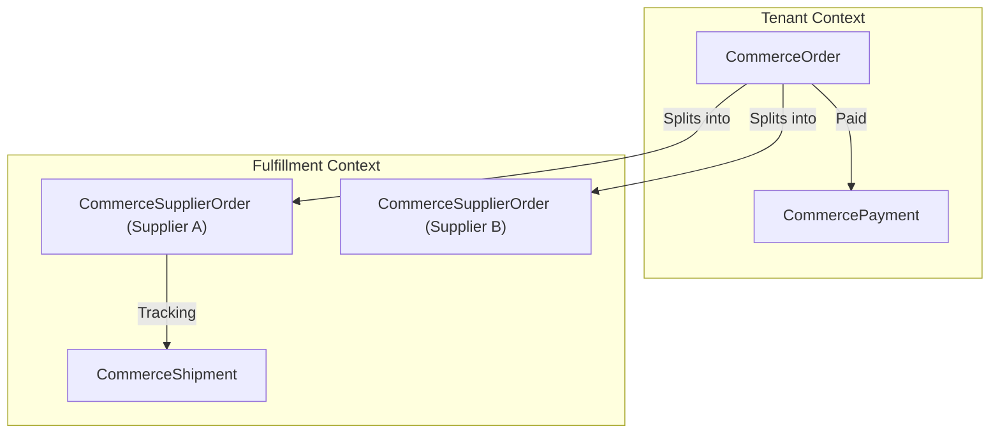

# Module 6 — Orders, Payments & Fulfillment

**Platform:** All-In-One V2 — Multi-Tenant Headless Commerce Platform
**Module Scope:** `CommerceOrder`, `CommerceOrderItem`, `CommerceSupplierOrder`, `CommerceShipment`, `CommercePayment`, `CommercePaymentEvent`, `CommerceWebhookEvent`
**Audience:** Backend engineers, financial ops
**Document Class:** SRS / Developer Documentation

---

## Module Architectural Position

This is the most critical financial module of the platform. Orders are fundamentally **tenant-scoped** documents. Once a checkout completes, the cart is converted into an immutable `CommerceOrder`.

Crucially, an order may contain items fulfilled by different dropshipping suppliers. Therefore, one `CommerceOrder` splits into many `CommerceSupplierOrder` fulfillment records.

## Business Purpose

1. **Financial Record Keeping:** Provide a historically accurate, immutable ledger of what was bought and what was charged.
2. **Payment Orchestration:** Track multi-attempt checkouts, webhooks from Paymongo/Stripe, and idempotent processing.
3. **Fulfillment Splitting:** Route items in a single customer order to the correct dropshipping suppliers.

## Responsibilities

| #   | Responsibility                | Enforced By                                                |
| --- | ----------------------------- | ---------------------------------------------------------- |
| 1   | Immutable historic ledger     | `CommerceOrderItem` duplicates `productTitle`, `unitPrice` |
| 2   | Idempotent webhook processing | `CommerceWebhookEvent` tracks `externalEventId`            |
| 3   | Payment tracking              | `CommercePayment` & `CommercePaymentEvent`                 |
| 4   | Exact-once analytics rollup   | `analyticsRecordedAt DateTime?` on `CommerceOrder`         |
| 5   | Dropship splitting            | `CommerceSupplierOrder` maps order items to suppliers      |

## Developer Notes

### Historical Immutability (The Snapshot Pattern)

The `CommerceOrderItem` explicitly copies `productTitle`, `sku`, and `attributes` rather than relying solely on the relation to `CatalogProductVariant`.
**Why:** If a merchant changes the price of a t-shirt or deletes the product entirely, historical orders MUST NOT change. A customer's receipt must reflect exactly what they bought at the time.

### Exactly-Once Analytics Rollup

`CommerceOrder.analyticsRecordedAt` is a genius design pattern for eventual consistency. The dashboard analytics aggregates are simple `+=` counters. To prevent double-counting if a webhook is retried, the worker doing the rollup flips `analyticsRecordedAt` from `NULL` to the current time in a transaction. If it's not `NULL`, the worker skips it.

### Webhook Idempotency

`CommerceWebhookEvent` stores `externalEventId` with a unique constraint. Payment gateways retry blindly. This table acts as a shield, preventing the system from fulfilling an order twice.

## Fields Explanation (Key Models)

### `CommerceOrder`

| Field                                     | Type      | Purpose           | Required | Notes                                                                 |
| ----------------------------------------- | --------- | ----------------- | -------- | --------------------------------------------------------------------- |
| `orderNumber`                             | `String`  | Human-readable ID | Yes      | Database-generated via `order_number_seq`. Safe from race conditions. |
| `subtotal`, `taxAmount`, `shippingAmount` | `Decimal` | Stored financials | Yes      | Must be stored, not computed on the fly, for tax compliance.          |
| `tenantId`                                | `String`  | Isolation         | Yes      | Orders never cross storefronts.                                       |

### `CommerceSupplierOrder`

| Field        | Type                  | Purpose                 | Required | Notes                                                                         |
| ------------ | --------------------- | ----------------------- | -------- | ----------------------------------------------------------------------------- |
| `supplierId` | `String`              | The drop-shipper        | Yes      |                                                                               |
| `externalId` | `String?`             | The supplier's order ID | No       | Written back via sync after the platform pushes the order to CJ Dropshipping. |
| `status`     | `SupplierOrderStatus` | Lifecycle               | Yes      | Distinct from the main `CommerceOrder.status`.                                |
