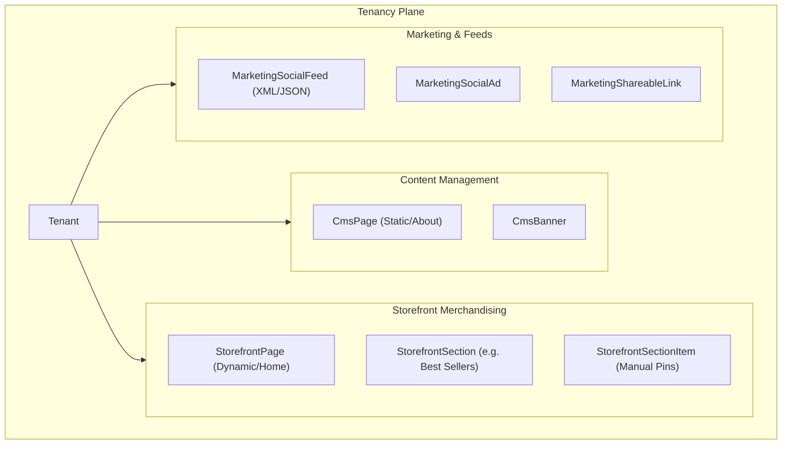

# Module 7 & 10 & 19 — CMS, Marketing & Storefront Merchandising

**Platform:** All-In-One V2 — Multi-Tenant Headless Commerce Platform
**Module Scope:** `CmsPage`, `CmsPageSection`, `CmsBanner`, `CmsAnnouncement`, `CmsFAQ`, `StorefrontPage`, `StorefrontSection`, `StorefrontSectionItem`, `MarketingSocialFeed`, `MarketingSocialAd`, `MarketingShareableLink`
**Audience:** Frontend engineers, marketing ops, content managers
**Document Class:** SRS / Developer Documentation

---

## Module Architectural Position

This module entirely powers the **Presentation Layer** and **Acquisition Layer** of the storefront. Everything here is strictly `tenantId` scoped.

## Business Purpose

1. **Storefront Merchandising:** Dynamic, strategy-driven page building. A `StorefrontSection` can be configured as "Trending" or "New Arrivals", and the backend computes the products on the fly.
2. **Static CMS:** Standard content pages (About Us, Terms of Service), FAQ sections, and top-bar announcements.
3. **Marketing Distribution:** Generating XML/JSON product feeds for Google Merchant Center and Meta Catalogs, and tracking affiliate/shareable links.

## Responsibilities

| #   | Responsibility                           | Enforced By                  |
| --- | ---------------------------------------- | ---------------------------- |
| 1   | Render dynamic product grids             | `StorefrontSectionStrategy`  |
| 2   | Allow manual overriding of dynamic grids | `StorefrontSectionItem` pins |
| 3   | Manage static SEO pages                  | `CmsPage` & `CmsPageSection` |
| 4   | Sync catalog to external ad platforms    | `MarketingSocialFeed`        |
| 5   | Track ad ROI                             | `MarketingSocialAd`          |

## Developer Notes

### Known Implementation Gaps (Critical)

| Gap                                             | Location                                | Impact                                                                                                                                                                                                                                                                                                                                                                                                                                                                                           |
| ----------------------------------------------- | --------------------------------------- | ------------------------------------------------------------------------------------------------------------------------------------------------------------------------------------------------------------------------------------------------------------------------------------------------------------------------------------------------------------------------------------------------------------------------------------------------------------------------------------------------ |
| **Merchandising Display Bug (Visibility Leak)** | `storefront.repository.ts` / Strategies | Six of the eight `StorefrontSectionStrategy` algorithms (`best-seller`, `trending`, `collection`, `flash-sale`, `manual`, `recommended`) **do not filter by `ProductStatus` or `deletedAt`**. Only `featured` and `new-arrival` do. This means a product marked `DRAFT`, `ARCHIVED`, or even soft-deleted will appear on the live storefront if it matches the algorithm criteria. Furthermore, the `ProductVisibility` enum (`HIDDEN`, `MEMBERS_ONLY`) is completely ignored by all algorithms. |

### Storefront vs CMS Pages

Why are there two page models?

- `CmsPage` is for static content blocks (text, images, HTML) constructed using `CmsPageSection`.
- `StorefrontPage` is for dynamic commerce blocks constructed using `StorefrontSection`. A `StorefrontSection` calls a backend strategy (e.g., `TRENDING`) to yield a list of products.

## Fields Explanation (Key Models)

### `StorefrontSection`

| Field          | Type    | Purpose              | Required | Notes                                               |
| -------------- | ------- | -------------------- | -------- | --------------------------------------------------- |
| `strategy`     | `Enum`  | The algorithm to run | Yes      | `MANUAL`, `COLLECTION`, `TRENDING`, etc.            |
| `config`       | `Json?` | Algorithm inputs     | No       | e.g. `{ days: 30 }` for a Trending calculation.     |
| `cacheMinutes` | `Int?`  | Caching layer hint   | No       | Heavy queries like `BEST_SELLERS` should be cached. |
