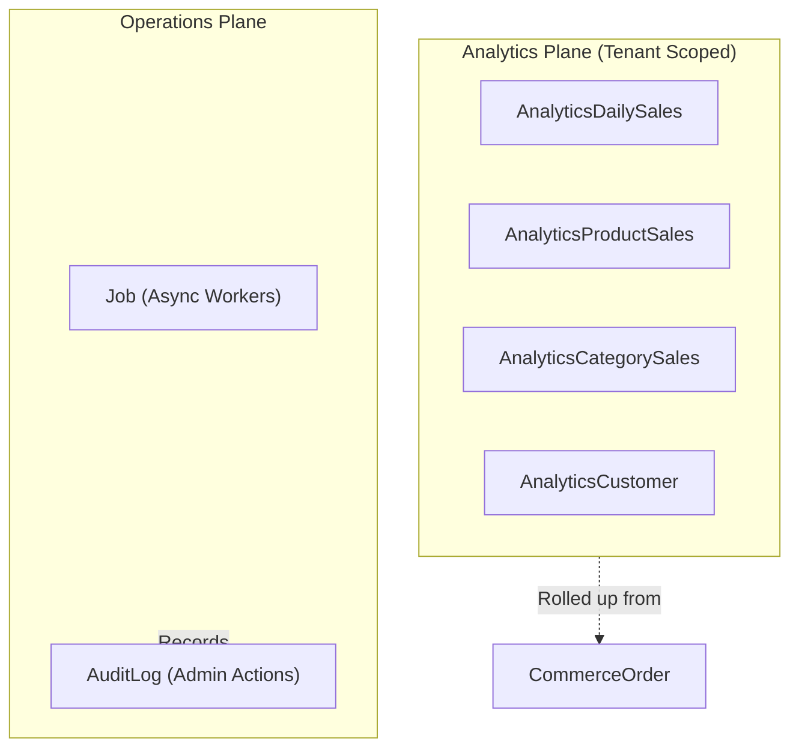

# Module 8 & 12 — Analytics, Jobs & Operational Auditing

**Platform:** All-In-One V2 — Multi-Tenant Headless Commerce Platform
**Module Scope:** `Job`, `JobLog`, `AuditLog`, `AnalyticsProductSales`, `AnalyticsCategorySales`, `AnalyticsSupplier`, `AnalyticsCustomer`, `AnalyticsDailySales`
**Audience:** Data engineers, platform operators, DevOps
**Document Class:** SRS / Developer Documentation

---

## Module Architectural Position

These models form the **Operations Plane**.

- Analytics aggregates are **tenant-scoped** and heavily optimized for dashboard rendering.
- Jobs and Audit Logs are **system-wide**, capable of executing or recording actions both globally (like Supplier Syncs) and within specific tenants.

## Business Purpose

1. **Dashboard Performance:** Pre-computing sales metrics (daily revenue, top products, top categories) ensures the admin dashboard loads instantly without running complex `SUM()` over millions of historical orders.
2. **Asynchronous Processing:** Long-running tasks (email sending, analytics rollups, inventory syncs) are pushed to the `Job` queue rather than blocking HTTP requests.
3. **Security & Accountability:** `AuditLog` records every mutation made by staff, answering "who changed this setting and when?"

## Responsibilities

| #   | Responsibility                   | Enforced By                                        |
| --- | -------------------------------- | -------------------------------------------------- |
| 1   | Manage async queues              | `Job.status` (PENDING, RUNNING, COMPLETED, FAILED) |
| 2   | Record job execution output      | `JobLog`                                           |
| 3   | Attribute admin actions          | `AuditLog.userId` & `AuditLog.action`              |
| 4   | Provide instant sales dashboards | `AnalyticsDailySales`, `AnalyticsProductSales`     |
| 5   | Track Customer LTV               | `AnalyticsCustomer.totalSpent`                     |

## Developer Notes

### The Analytics Rollup Architecture

As noted in Module 6 (`CommerceOrder`), the analytics tables are populated by a background job.

1. When an order is paid, it is **not** immediately added to `AnalyticsDailySales`.
2. A background worker periodically finds orders where `analyticsRecordedAt == null`.
3. It uses a database transaction to `+=` the revenue onto `AnalyticsDailySales`, `AnalyticsProductSales`, etc.
4. In the same transaction, it sets `analyticsRecordedAt = NOW()`.
   This decoupling ensures that checkout is incredibly fast and immune to analytics-related deadlocks.

### Audit Log Usage

Whenever a controller protected by `authorize(...ADMIN_ROLES)` modifies data, it MUST emit an `AuditLog` row. The `previousData` and `newData` JSON fields should contain a strict diff of the changes, not the entire payload, to save space.

## Fields Explanation (Key Models)

### `Job`

| Field       | Type      | Purpose          | Required | Notes                                                         |
| ----------- | --------- | ---------------- | -------- | ------------------------------------------------------------- |
| `queue`     | `String`  | Worker targeting | Yes      | e.g. "high_priority", "analytics", "emails".                  |
| `retries`   | `Int`     | Failure recovery | Yes      | Checked against `maxRetries` before failing permanently.      |
| `lockOwner` | `String?` | Concurrency      | No       | The hostname/PID of the worker currently processing this job. |

### `AnalyticsDailySales`

| Field          | Type       | Purpose       | Required | Notes                                                             |
| -------------- | ---------- | ------------- | -------- | ----------------------------------------------------------------- |
| `date`         | `DateTime` | Grouping key  | Yes      | `@@unique([tenantId, date])`. Must be normalized to midnight UTC. |
| `totalRevenue` | `Decimal`  | Financial sum | Yes      |                                                                   |
| `orderCount`   | `Int`      | Volume sum    | Yes      |                                                                   |
