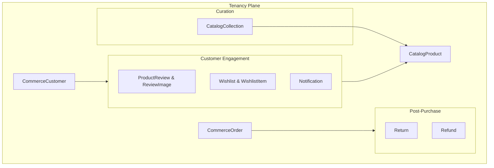

# Module 9 & 11 & 14 — Engagement, Reviews & Collections

**Platform:** All-In-One V2 — Multi-Tenant Headless Commerce Platform
**Module Scope:** `ProductReview`, `ReviewImage`, `Wishlist`, `WishlistItem`, `Return`, `Refund`, `Notification`, `CatalogCollection`, `CatalogCollectionItem`
**Audience:** Full-stack engineers, customer support, merchandising
**Document Class:** SRS / Developer Documentation

---

## Module Architectural Position

These models handle **post-purchase workflows**, **customer retention**, and **curated browsing**. They are strictly **tenant-scoped**.

## Business Purpose

1. **Social Proof:** Customers leave verified reviews and photos on products.
2. **Customer Intent:** Saving items for later via Wishlists.
3. **In-App Messaging:** Delivering system alerts and promotions directly into the user's dashboard via Notifications.
4. **Reverse Logistics:** Managing product returns and processing financial refunds.
5. **Curation:** Merchandisers group products into Collections (e.g., "Summer Essentials", "Gifts under $50").

## Responsibilities

| #   | Responsibility                     | Enforced By                                  |
| --- | ---------------------------------- | -------------------------------------------- |
| 1   | Store UGC (User Generated Content) | `ProductReview`, `ReviewImage`               |
| 2   | Enforce "Verified Buyer" badges    | `ProductReview.isVerified`                   |
| 3   | Manage RMAs (Return Merchandise)   | `Return.status`, `Return.reason`             |
| 4   | Handle partial/full refunds        | `Refund.amount`, `Refund.transactionId`      |
| 5   | Group products logically           | `CatalogCollection`, `CatalogCollectionItem` |

## Developer Notes

### Verified Buyer Enforcement

`ProductReview.isVerified` is a boolean. When a review is submitted, the backend MUST query `CommerceOrder` and `CommerceOrderItem` for that `customerId` and `productId`. If an order exists with status `FULFILLED`, the review is marked verified.

### Refunds & Immutability

A `Refund` is a financial document. It points to a `Return` (optional) and an `orderId`. Refunds do not delete `CommerceOrderItem` rows; they represent a counter-transaction. The `Refund.transactionId` must map exactly to the gateway's refund receipt ID for reconciliation.

### Collection Dynamic vs Static

`CatalogCollection` is currently modelled as a manual curation table (via `CatalogCollectionItem`).
If the business requests "Smart Collections" (e.g., "All items where tag = sale"), this schema requires an update to include a `ruleDefinition Json?` field on the `CatalogCollection` model to evaluate products dynamically.

### "Get the Look" vs. "Shop the Look" — one table pair, two placements

Both storefront widgets are the **same** `CatalogCollection` + `CatalogCollectionItem` pair. There is no separate table per placement — what differs is only the data, specifically `CatalogCollection.categoryId`:

| Widget | Where it renders | Query | `categoryId` |
| --- | --- | --- | --- |
| **Shop the Look** | Category detail pages (e.g. `/categories/tops`) | `GET /v2/collections?categorySlug=tops` | Set — resolved server-side to the category's ID; only collections tagged to that category are returned. |
| **Get the Look** | Homepage hero | `GET /v2/collections` (no `categorySlug`) | Null — omitting `categorySlug` skips the category filter entirely and returns every top-level collection for the tenant. |

An unknown `categorySlug` intentionally resolves to zero results rather than silently falling back to "show everything" (`collection.service.ts`, `listCollections`) — the same convention `ProductService.listProducts` uses.

`type` (`OUTFIT | SETUP | ROUTINE | BUNDLE | LOOKBOOK | ROOM_BUNDLE`) is a display/merchandising label, not what scopes a collection to a placement — a `LOOKBOOK`-typed row can still be category-scoped, and an `OUTFIT`-typed row can still be homepage-wide. Don't use `type` to control where something appears; use `categoryId`.

**Frontend status (as of this writing):** only the category-page widget (`tenants/fashion/components/TrendingLookbook.tsx`, via `useCollections()`) is actually wired to this API. The homepage widget (`tenants/fashion/components/HeroBanner.tsx`'s "Get the Look" carousel) still reads a static `data/looks.ts` mock and has not been ported to `useCollections()` yet — seeding `CatalogCollection` rows with `categoryId: null` will not yet appear there until that frontend change is made.

## Fields Explanation (Key Models)

### `CatalogCollection`

| Field | Type | Purpose | Required | Notes |
| --- | --- | --- | --- | --- |
| `type` | `CollectionType` | Merchandising label | Yes | `OUTFIT`, `SETUP`, `ROUTINE`, `BUNDLE`, `LOOKBOOK`, `ROOM_BUNDLE`. Display-only — see note above. |
| `categoryId` | `String?` | Placement scope | No | Null = homepage/tenant-wide ("Get the Look"). Set = that category's page only ("Shop the Look"). |
| `parentId` | `String?` | Nesting | No | Self-referential — a parent `LOOKBOOK` can hold child `OUTFIT`/`ROUTINE` collections across verticals. |
| `imageUrl` | `String?` | Hero image | No | Rendered as the large "active look" image on the storefront. |
| `metadata` | `Json?` | Vertical-specific params | No | e.g. `{ climate, style, roomType, season }`. |
| `isPublic` | `Boolean` | Visibility | Yes | Defaults `true`. |

### `CatalogCollectionItem`

| Field | Type | Purpose | Required | Notes |
| --- | --- | --- | --- | --- |
| `productId` | `String` | Linked product | Yes | Every slot must resolve to a real `CatalogProduct` — clicking it navigates there. |
| `productVariantId` | `String?` | Linked variant | No | Null = frontend shows the product's default/primary variant. |
| `slot` | `String?` | Semantic role | No | e.g. `"UpperGarment"`, `"Footwear"` — matches the `BASE`/`OVER` tag split the frontend renders as "Base Item" / "Accessory Items". |
| `position` | `Int` | Display order | Yes | Defaults `0`. |
| `isOptional` | `Boolean` | Required vs. optional in the set | Yes | Defaults `false`. |
| `imageUrl` | `String?` | Per-item image override | No | Falls back to the product's `thumbnailUrl` when unset. |

### `Return`

| Field     | Type           | Purpose      | Required | Notes                                          |
| --------- | -------------- | ------------ | -------- | ---------------------------------------------- |
| `status`  | `ReturnStatus` | Lifecycle    | Yes      | `PENDING`, `APPROVED`, `REJECTED`, `RECEIVED`. |
| `orderId` | `String`       | Source order | Yes      | Links the return to the original purchase.     |

### `Notification`

| Field    | Type      | Purpose | Required | Notes                                                                                                        |
| -------- | --------- | ------- | -------- | ------------------------------------------------------------------------------------------------------------ |
| `userId` | `String`  | Target  | Yes      | Points to `AuthUser` so the notification hits the global identity dashboard, even though it's tenant-scoped. |
| `isRead` | `Boolean` | State   | Yes      | Used for unread badge counters on the frontend.                                                              |
