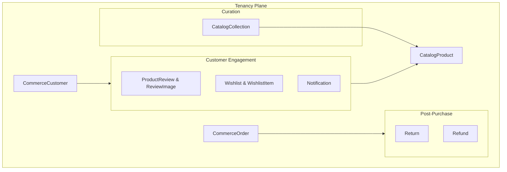

# Module 9 & 11 & 14 — Engagement, Reviews & Collections

**Platform:** All-In-One V2 — Multi-Tenant Headless Commerce Platform
**Module Scope:** `ProductReview`, `ReviewImage`, `Wishlist`, `WishlistItem`, `Return`, `Refund`, `Notification`, `CatalogCollection`, `CatalogCollectionItem`
**Audience:** Full-stack engineers, customer support, merchandising
**Document Class:** SRS / Developer Documentation

---

## Module Architectural Position

These models handle **post-purchase workflows**, **customer retention**, and **curated browsing**. They are strictly **tenant-scoped**.

## Business Purpose

1. **Social Proof:** Customers leave verified reviews and photos on products.
2. **Customer Intent:** Saving items for later via Wishlists.
3. **In-App Messaging:** Delivering system alerts and promotions directly into the user's dashboard via Notifications.
4. **Reverse Logistics:** Managing product returns and processing financial refunds.
5. **Curation:** Merchandisers group products into Collections (e.g., "Summer Essentials", "Gifts under $50").

## Responsibilities

| #   | Responsibility                     | Enforced By                                  |
| --- | ---------------------------------- | -------------------------------------------- |
| 1   | Store UGC (User Generated Content) | `ProductReview`, `ReviewImage`               |
| 2   | Enforce "Verified Buyer" badges    | `ProductReview.isVerified`                   |
| 3   | Manage RMAs (Return Merchandise)   | `Return.status`, `Return.reason`             |
| 4   | Handle partial/full refunds        | `Refund.amount`, `Refund.transactionId`      |
| 5   | Group products logically           | `CatalogCollection`, `CatalogCollectionItem` |

## Developer Notes

### Verified Buyer Enforcement

`ProductReview.isVerified` is a boolean. When a review is submitted, the backend MUST query `CommerceOrder` and `CommerceOrderItem` for that `customerId` and `productId`. If an order exists with status `FULFILLED`, the review is marked verified.

### Refunds & Immutability

A `Refund` is a financial document. It points to a `Return` (optional) and an `orderId`. Refunds do not delete `CommerceOrderItem` rows; they represent a counter-transaction. The `Refund.transactionId` must map exactly to the gateway's refund receipt ID for reconciliation.

### Collection Dynamic vs Static

`CatalogCollection` is currently modelled as a manual curation table (via `CatalogCollectionItem`).
If the business requests "Smart Collections" (e.g., "All items where tag = sale"), this schema requires an update to include a `ruleDefinition Json?` field on the `CatalogCollection` model to evaluate products dynamically.

## Fields Explanation (Key Models)

### `Return`

| Field     | Type           | Purpose      | Required | Notes                                          |
| --------- | -------------- | ------------ | -------- | ---------------------------------------------- |
| `status`  | `ReturnStatus` | Lifecycle    | Yes      | `PENDING`, `APPROVED`, `REJECTED`, `RECEIVED`. |
| `orderId` | `String`       | Source order | Yes      | Links the return to the original purchase.     |

### `Notification`

| Field    | Type      | Purpose | Required | Notes                                                                                                        |
| -------- | --------- | ------- | -------- | ------------------------------------------------------------------------------------------------------------ |
| `userId` | `String`  | Target  | Yes      | Points to `AuthUser` so the notification hits the global identity dashboard, even though it's tenant-scoped. |
| `isRead` | `Boolean` | State   | Yes      | Used for unread badge counters on the frontend.                                                              |
