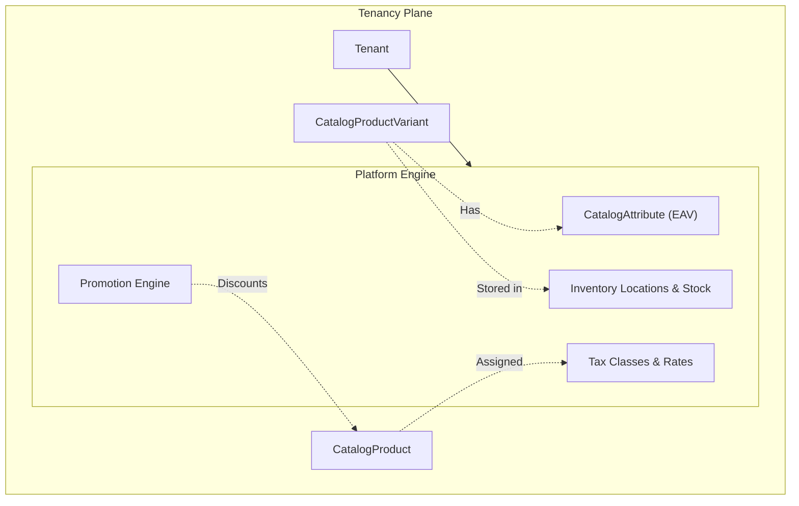

# Module 15 & 16 — Platform Engine: Attributes, Promotions, Inventory & Tax

**Platform:** All-In-One V2 — Multi-Tenant Headless Commerce Platform
**Module Scope:** `CatalogAttribute`, `Promotion`, `InventoryLocation`, `InventoryStock`, `TaxClass`, `TaxRate`
**Audience:** Backend engineers, data engineers
**Document Class:** SRS / Developer Documentation

---

## Module Architectural Position

This module constitutes the **Platform Engine** — the underlying mechanisms that give flexibility to the catalog and commerce domains. Everything here is strictly **tenant-scoped** and heavily uses composite foreign keys (`@@unique([tenantId, id])`) to enforce isolation.

## Business Purpose

1. **Entity-Attribute-Value (EAV):** Allows merchants to define arbitrary product filters (e.g., "Screen Size", "Material") without altering the database schema.
2. **Promotions Engine:** A decoupled, rules-based engine for cart/item discounts.
3. **Multi-Location Inventory:** Tracks stock physically across multiple warehouses and retail stores.
4. **Tax Calculation:** Assigns tax brackets to products and resolves the correct rate based on the customer's shipping address.

## Responsibilities

| #   | Responsibility                    | Enforced By                                     |
| --- | --------------------------------- | ----------------------------------------------- |
| 1   | Define custom product attributes  | `CatalogAttribute` & `CatalogAttributeValue`    |
| 2   | Assign attributes to variants     | `CatalogVariantAttribute`                       |
| 3   | Define discount rules and payouts | `Promotion`, `PromotionRule`, `PromotionReward` |
| 4   | Manage physical/virtual locations | `InventoryLocation`                             |
| 5   | Track location-specific stock     | `InventoryStock`                                |
| 6   | Define product tax brackets       | `TaxClass`                                      |
| 7   | Resolve geographic tax rates      | `TaxRate`                                       |

## Developer Notes

### Inventory Concurrency & Stock Allocation

`InventoryStock` uses a `version Int @default(1)` column for **Optimistic Concurrency Control (OCC)**.
When a checkout is happening, the system increments `reserved` and increments `version`. If two checkouts hit the same stock row simultaneously, Prisma will fail one of them via the version check (`where: { id, version }`), preventing overselling.

The `available` column is theoretically computed (`onHand - reserved`), but is stored physically for faster read queries (filtering out-of-stock items on the catalog).

### Tax Resolution

`CatalogProduct` points to a `TaxClass` (e.g., "Standard Goods"). When a customer checks out, the system looks at their `CommerceShippingAddress`, specifically the `country` and `state`. It then queries `TaxRate` for that `TaxClass` + `country` + `state`.

### Promotions Architecture

The Promotion engine is highly normalized to allow complex combinations:

- **`PromotionRule`**: The "IF" (e.g., Minimum Cart Total > $50)
- **`PromotionReward`**: The "THEN" (e.g., 20% Off)
- **`PromotionTarget`**: The "WHERE" (e.g., Apply only to Category X or Product Y)

## Fields Explanation (Key Models)

### `InventoryStock`

| Field      | Type  | Purpose            | Required | Notes                                   |
| ---------- | ----- | ------------------ | -------- | --------------------------------------- |
| `onHand`   | `Int` | Physical count     | Yes      | What is actually on the shelf.          |
| `reserved` | `Int` | Locked in checkout | Yes      | Claimed by an unpaid or pending order.  |
| `version`  | `Int` | OCC Token          | Yes      | Crucial for preventing race conditions. |

### `CatalogAttributeValue`

| Field         | Type      | Purpose            | Required | Notes                                                |
| ------------- | --------- | ------------------ | -------- | ---------------------------------------------------- |
| `value`       | `String`  | Machine identifier | Yes      | e.g. "red". Used in URL query params (`?color=red`). |
| `swatchColor` | `String?` | Hex code           | No       | Sent to the storefront to render UI color swatches.  |
